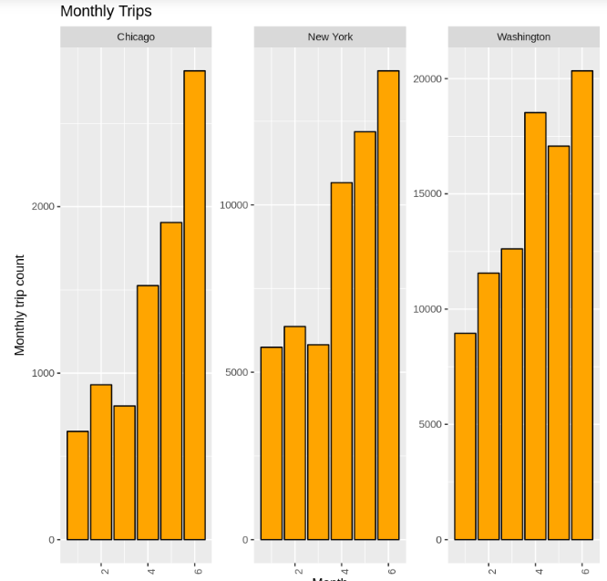
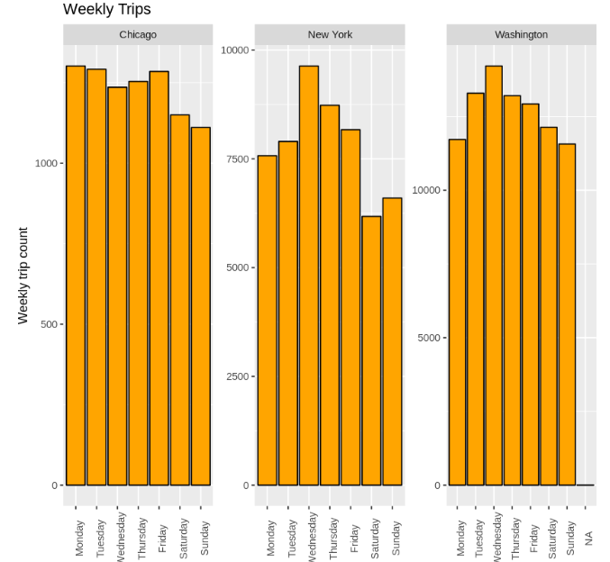
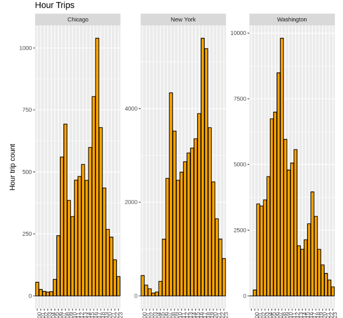
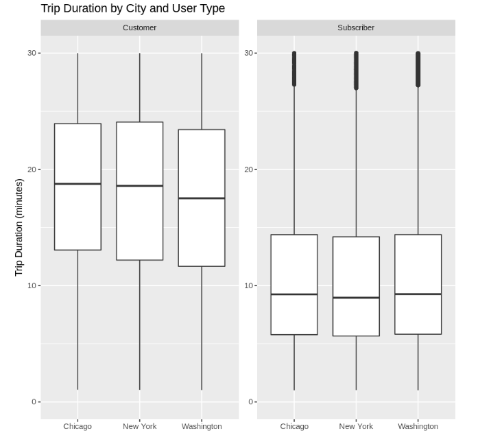

## This project just for learning Data-Analysis-with-R

# Overview

Analyzing bike share data from three major cities – Chicago, New York, and Washington DC. 
Using R language and ggplot2 can provide valuable insights into usage patterns, trends, and user behaviors. 
Below is a summary of the results achieved:

